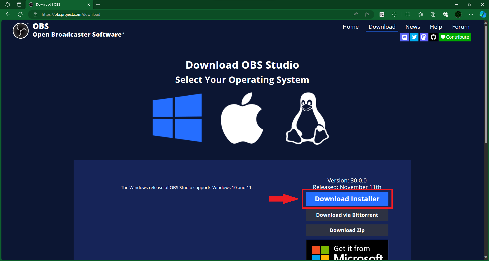

__OBS Studio__ là một phần mềm miễn phí và open source (mã nguồn mở) phục vụ cho quay màn hình và stream.

Tải OBS Studio tại trang chủ của họ: https://obsproject.com/

Ấn vào __Download__ ở góc trên bên phải của trang web. Tại đây, bạn sẽ thấy OBS tự gợi ý bản cài phù hợp với hệ điều hành của bạn.

Hãy ấn vào nút __Download__ màu đỏ và cài đặt theo mặc định.

Hướng dẫn chi tiết: 
